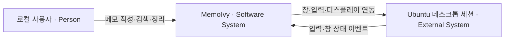

# C1 · 시스템 맥락

```mermaid
flowchart LR
    user["로컬 사용자 · Person"]
    app["MemoIvy · Software System"]
    desktop["Ubuntu 데스크톱 세션 · External System"]
    user -->|메모 작성·검색·정리| app
    app -->|창·입력·디스플레이 연동| desktop
    desktop -->|입력·창 상태 이벤트| app
```

- 개인 메모를 로컬에 보관하는 Ubuntu 앱.
- UI 기반 선택: ADR-0001. 저장 선택: ADR-0002.
