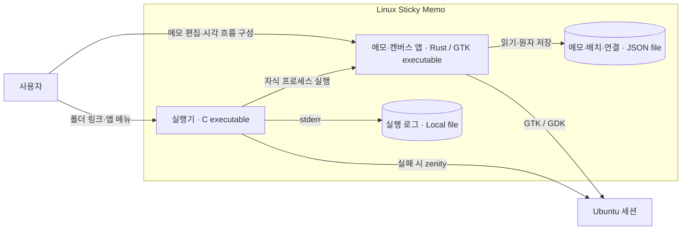

# C2 · 실행·저장 단위

```mermaid
flowchart LR
    user["사용자"]
    desktop["Ubuntu 세션"]
    subgraph system["Linux Sticky Memo"]
        launcher["실행기 · C executable"]
        app["메모·캔버스 앱 · Rust / GTK executable"]
        notes[("메모·배치·연결 · JSON file")]
        log[("실행 로그 · Local file")]
    end
    user -->|폴더 링크·앱 메뉴| launcher
    launcher -->|자식 프로세스 실행| app
    launcher -->|stderr| log
    launcher -->|실패 시 zenity| desktop
    user -->|메모 편집·시각 흐름 구성| app
    app -->|GTK / GDK| desktop
    app -->|읽기·원자 저장| notes
```

- 목록·편집기·캔버스는 같은 프로세스와 메모 원본을 공유한다. 앱 안에 GTK 메인 스레드와 저장 worker가 있다. SVG·CSS는 내장 자산이다.
- 실행 통합: launcher·install 키워드. 저장 위치·복구: OPS-002.
