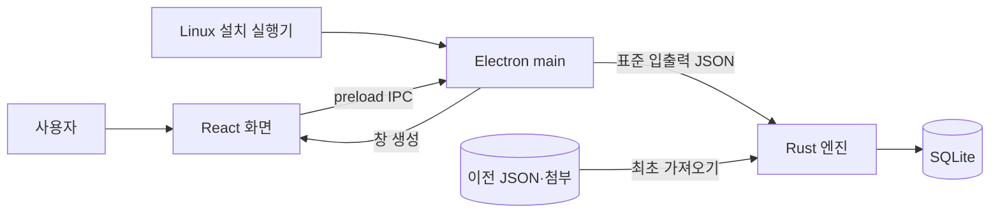

# C2 · 실행·저장 단위

```mermaid
flowchart LR
    user["사용자"] --> ui["React 화면"]
    launcher["Linux 설치 실행기"] --> host["Electron main"]
    host -->|창 생성| ui
    ui -->|preload IPC| host
    host -->|표준 입출력 JSON| engine["Rust 엔진"]
    engine --> db[("SQLite")]
    legacy[("이전 JSON·첨부")] -->|최초 가져오기| engine
```

목록·편집기·캔버스는 같은 엔진을 공유한다. Linux 메뉴 실행과 로그는 OPS-001, 데이터 복구는 OPS-002를 따른다. 경계 결정은 ADR-0013에 기록한다.
